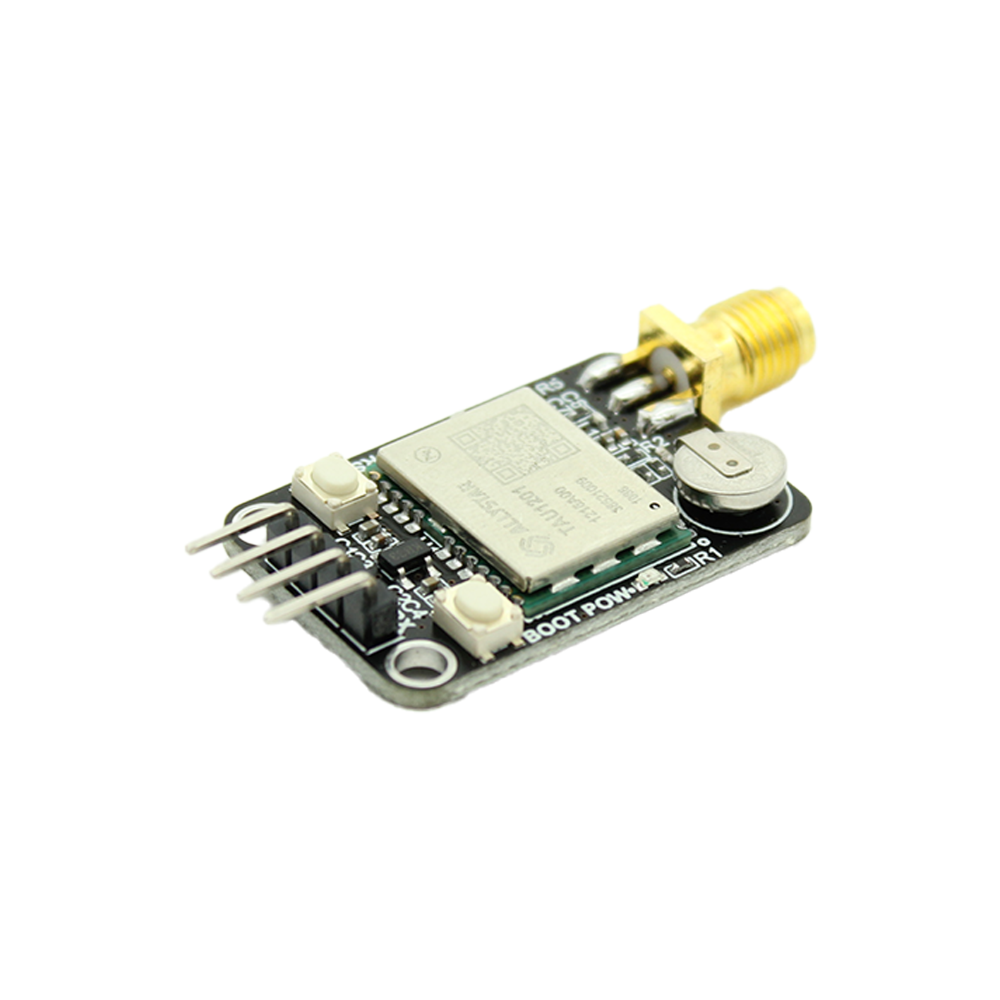

# 逐飞科技GN42A双频GPS定位模块资料

#### 介绍
逐飞科技针对需要使用GPS定位应用场景，基于华大北斗TAU1201模组精心制作了双频GPS定位模块。

#### 学习套件
双频GPS定位模块:[点击此处购买](https://item.taobao.com/item.htm?id=667862603428&pisk=g8hnxRfNGvyBI_dDOGNBH4O_03pORWN7D0C827EyQlr19vLIvT2rDm2PwpNLE7maXXEKJWrPZ03-903rwzluOfHdwkKQZ4oYZnKvMI3IR8NyDnFsJTpzgy5FagUr75P8rVyAiB0IR7ZPWgJxQ2slTFYCYzryS5zuk6PzL9ywSyUba6yPTVraflrzakrU7OzQkuWzzy8GQr4f4TyzzVralzIza7or7F47bylhawrqaYlwbDQ1THcnqf43KouMh_5ubseU0JqNanlg-nZq8lfPak1aT4giJHfjWWGsmrnp_6mm8xor3cRGtRMESb2jNLCK87q3HXyh8HwgEkDZTRbPa2gsI0HoxHXQYvnghPyNrIatDluITAY5b2oYxWzaBI8m78ktO-Gpb6Vqh2FKUcRGtmSPHOW4yf577UhNFTwU5Pqx1tfeR6pisjYMStM7LPa0DFYGFTwU5PqvSFXXRJz_ooC..&spm=a1z10.3-c-s.w4002-22508770840.10.648449ccWSKjiA)。

#### GN42A双频GPS定位模块

#### 基础参数

1. **卫星接收频段**：**GPS**：L1、L5；**BDS（北斗）**：B1I、B2A；**GLONASS（格洛纳斯）**：L1OF；**GALLEO（伽利略）**：E1、E5A
2. **定位精度**：双频定位时精度最好可达1米以内的精度
3. **数据更新速率**：最大可设置为 10Hz，默认为 1Hz
4. **串口波特率**：115200   (8 位数据位、无校验位、1位停止位)
5. **速度精度**：速度精度为 0.1m/s
6. **时间精度**：时间精度为 20ns
7. **坐标系**：WGS-84 坐标系
8. **数据格式**：NMEA 0183 协议 版本 V4.0/4.1
9. **供电电压**：5V(模块上有 LDO 稳压)
10. **首次定位时间**：**热启动**：1 秒；**冷启动**：32秒
11. **灵敏度**：**冷启动** ：-148dBm；**热启动**：-155dBm；**重捕获**：-158dBm；**跟踪**：-162dBm
12. **测量极限**：**高度**：18000 米；**速度**：515m/s
13. **工作电流**：**单频定位**：23mA；**双频定位**：42mA
